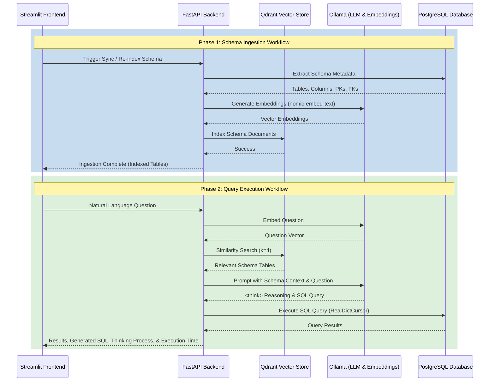

# Schema-RAG Text-to-SQL

Schema-RAG is a local, privacy-preserving Text-to-SQL engine that leverages Retrieval-Augmented Generation (RAG) to generate and execute accurate PostgreSQL queries from natural language questions. 

By running entirely on your local machine using Docker, it securely analyzes your database schema without sending any data to external APIs.

## Architecture & Technology Stack

- **Target Database**: PostgreSQL (Host instance)
- **Vector Store**: Qdrant (Containerized)
- **Local LLM & Embeddings**: Ollama (Containerized)
  - LLM: `qwen2.5-coder:7b` (Optimized for coding & SQL generation)
  - Embeddings: `nomic-embed-text`
- **Backend Service**: FastAPI & LangChain
- **Frontend UI**: Streamlit

## Core Features

- **Dynamic Schema Ingestion**: Automatically extracts tables, columns, data types, primary keys, and foreign keys from your PostgreSQL database and indexes them into Qdrant for semantic search.
- **RAG-Powered SQL Synthesis**: Uses vector similarity search to fetch only the most relevant table schemas for a user's question, reducing token usage and hallucination.
- **Model Thinking & Reasoning**: Instructs the LLM to provide step-by-step reasoning (`<think>` blocks) before outputting the SQL query, which is displayed directly in the UI.
- **Safe Execution & Tracking**: Automatically executes read-only queries against the database, returning structured results in interactive UI tables alongside precise execution time tracking.

## Application Workflow

The following diagram illustrates the two main workflows of the application: **Schema Ingestion** and **Query Execution**.



## Getting Started

1. **Start the environment**:
   ```bash
   docker compose up -d --build
   ```
2. **Pull Required Ollama Models** (On first startup):
   ```bash
   docker exec -it schema_rag_ollama ollama pull qwen2.5-coder:7b
   docker exec -it schema_rag_ollama ollama pull nomic-embed-text
   ```
3. **Access the UI**: Open your browser and navigate to `http://localhost:8501`.
4. **Sync Schema**: Use the sidebar in the Streamlit UI to **Sync / Re-index Schema** before asking your first question.
